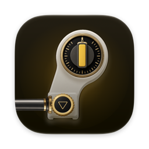
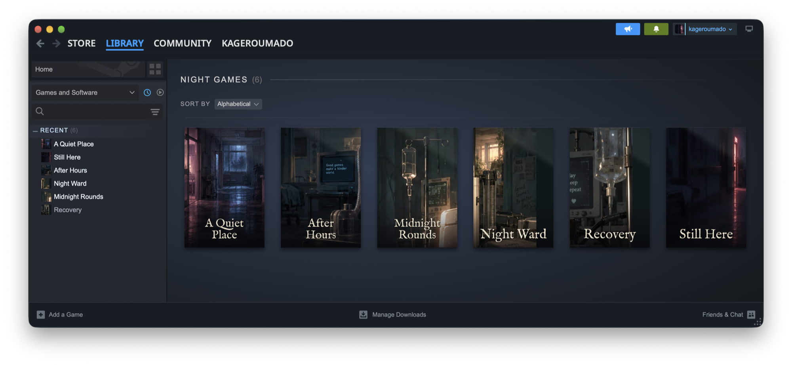
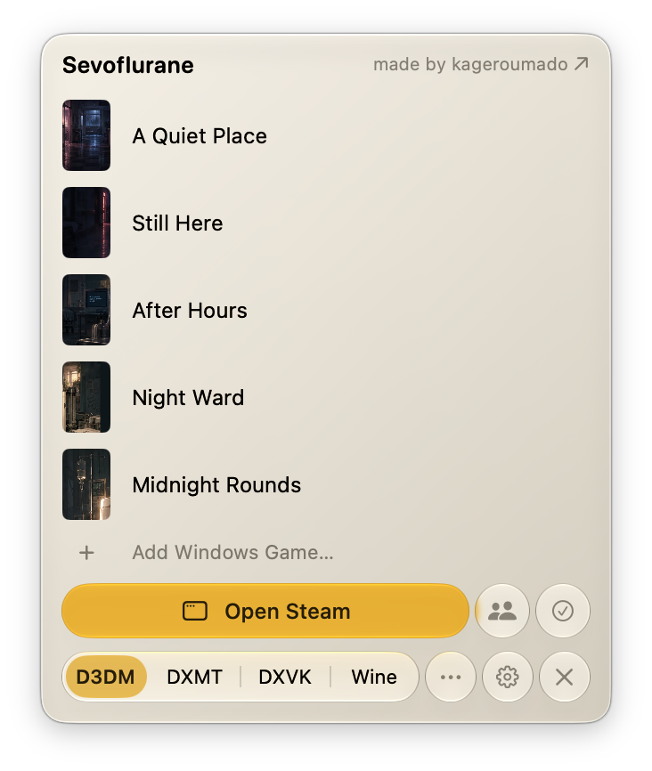
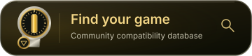

<div align="center">

[](https://kagerou.glass/sevoflurane/)



# Sevoflurane

[English](README.md) · [简体中文](README.zh-CN.md)

**rx no. 013 ・ se·vo·flu·rane /ˌsiːvoʊˈflʊəreɪn/ ・ a volatile anesthetic for games ♡**

[](https://kagerou.glass/sevoflurane/)
[](https://x.com/kageroumado)
[](#get-started)

<a href="https://github.com/kageroumado/sevoflurane/releases/download/v1.0.0-beta.1/Sevoflurane-1.0.0-beta.1.dmg"></a>

<table>
  <tr>
    <td align="center"><br><sub><b>steam, rehoused</b> ・ the library in a Mac window</sub></td>
    <td align="center"><br><sub><b>the menu bar</b> ・one click to play</sub></td>
  </tr>
</table>

</div>

**Play Windows Steam games on an Apple silicon Mac, with Steam's interface
in Mac windows.**

Browse your library, install games and chat with friends through Steam.
Sevoflurane uses Wine to run the Windows Steam client and compatible games
in the background.

## Will my game run?

The [community compatibility database](https://kagerou.glass/sevoflurane/games/)
shows how games run on different Macs and renderers. It grows from actual play
sessions recorded by Sevoflurane when players opt in to **Share run statistics**.
Shared runs include the engine, renderer, hardware, resolution, gameplay frame
rate and how the session ended; the database uses these to calculate its verdicts.

To contribute, enable **Settings › General › Community › Share run statistics**
and play. Games appear as players share their runs.

<p align="center"><a href="https://kagerou.glass/sevoflurane/games/"></a></p>

## Highlights

- **Steam, always Retina.** Steam's interface runs in native web views at the
  screen's real scale, with its menus in the menu bar and Steam's
  notifications as Mac notifications.
- **Windows that behave.** Every game is a real Mac window. Fixed-size games,
  even old ones that never allowed it, become resizable and go native full
  screen.
- **Optional upscaling.** A game can render at its own resolution while the
  picture is upscaled to fit, with Lanczos, MetalFX, or Anime4K and CuNNy for
  anime art.
- **DirectX 12.** Games run through [Dormison](https://github.com/kageroumado/dormison),
  Sevoflurane's own build of Wine, with D3DMetal from Apple's Game Porting
  Toolkit.
- **Game Mode, automatically.** Each game launches as its own Mac app with its
  own name and Dock icon, so macOS turns on Game Mode when it fills the
  screen.
- **Not just Steam.** Open any Windows program from Finder. Sevoflurane tells
  a game from an installer, runs or installs it, and gives it the same
  treatment.

## Get started

1. **Download and open.** Sevoflurane is in beta, at 1.0 beta 1. Mount the
   [disk image](https://github.com/kageroumado/sevoflurane/releases/download/v1.0.0-beta.1/Sevoflurane-1.0.0-beta.1.dmg)
   (every version is on the [releases page](https://github.com/kageroumado/sevoflurane/releases)),
   drag Sevoflurane to Applications, then launch it.
2. **Install the engine and dependencies.** Choose Dormison or CrossOver as
   the engine, then create a bottle or adopt one you already have.
3. **Sign in** to Steam, the way you always do.
4. **Play.** You can change the engine at any time, and each game can have its
   own settings.

Sevoflurane needs macOS 26 or later on Apple silicon. Setup installs Rosetta
when it is missing. For DirectX 12 games, add Apple's Game Porting Toolkit
during setup; the download uses Apple's sign-in. CrossOver includes its own
copy of D3DMetal, the toolkit's graphics translator.

## Renderers

Settings › Graphics sets the default renderer; a game's menu in the menu bar,
or Settings › Games, sets one game's.

| Renderer | Supports | Use |
|---|---|---|
| **D3DMetal** | Direct3D 11 and 12 through Apple's Game Porting Toolkit | Required for DirectX 12. Install the toolkit when using Dormison. |
| **DXMT** | Direct3D 10 and 11 through Metal | Dormison's default before D3DMetal is installed. |
| **DXVK** | Direct3D 9 to 11 through Vulkan and MoltenVK | An option for DirectX 9 games, or when a Metal renderer has problems. |
| **Automatic** | CrossOver's per-game choices, with Wine's renderer as fallback | Uses CrossOver's database when running CrossOver. |
| **Wine built-in** | Wine's `wined3d` renderer | Another option for games that have trouble with the other renderers. |

Toolkit releases and betas can be installed side by side. The newest is
selected unless you choose another. DXMT and DXVK versions can also be
installed separately.

Window, upscaler and mouse settings apply at the game's next launch when the
engine supports per-game configuration files; other engines need a Steam
restart for inherited settings.

Launch from the menu bar to apply renderer changes. Sevoflurane can stage
renderer files while Steam stays open; engine and msync+ changes require a
restart. Changes to the selected DXMT or DXVK version apply after Steam
restarts.

## Known limits

- Games and online modes that need Windows kernel anti-cheat do not run; a
  game's offline mode may still work.
- Honkai: Star Rail installs and updates, but its protection closes it a few
  seconds after it starts under Wine.
- The Windows side runs under Rosetta, so it needs Rosetta installed and
  pays its translation cost. Setup installs Rosetta when it is missing.
- DirectX 12 needs Apple's Game Porting Toolkit, which only Apple may
  distribute; setup downloads it through your Apple Account. 32-bit
  DirectX 12 games do not run.
- The upscaler joins a game when the game starts. Switching between
  upscalers applies at once; turning it on or off for a game that started
  the other way applies at the next launch.
- OpenGL drawables that are multisampled, stereo, floating-point or 10-bit
  are shown without the upscaler. DXMT and DXVK through the presenter are
  untested.
- The Experimental thread-waiting preset shortens waits between threads in
  synthetic tests and has not raised the frame rate of any game measured
  (Black Myth: Wukong, Rise of the Tomb Raider). It is off by default; the
  Custom preset opens its three numbers.
- Media Foundation video decodes in software.
- Unity games on Mono that crash within seconds of launch (TABS, Aka Manto)
  are an open engine bug.
- Steam's in-game overlay is a window Sevoflurane hosts beside the game; it
  does not draw inside the game's own picture.

## Reporting a problem

**Settings › About › Save Diagnostics…** saves a ZIP containing logs,
a `sevo doctor` report, engine details, Steam's own logs and recent crash
reports. Your account name, home folder paths, the Mac's name and Steam ids are
taken out of every file in it; look through it before sharing all the same.
You can also run `sevo diag` from the terminal.

When a game crashes, hangs until the watchdog ends it, or quits with an
error while starting, Sevoflurane asks whether to send that run's redacted
report to the developers. A crash counts even when the game's own crash
handler ends it quietly. "Never ask
again" turns the question off.

The main logs are `~/Library/Logs/Sevoflurane.log` and
`~/Library/Logs/Sevoflurane-wine.log`. The Wine log always records errors and
exceptions, so a game that exits on its own still leaves a trail. Settings ›
Diagnostics sets how much a run records, and Settings › Engine › *Log every
library a game loads* adds each library load when that is not enough.
`sevo runs` lists what every launch ran on and how it ended, and the Reports
window shows the same records with what each crash left behind.

Use the [issue templates](https://github.com/kageroumado/sevoflurane/issues/new/choose)
to report a problem. See [CONTRIBUTING.md](CONTRIBUTING.md) for debugging
and contribution instructions.

## Command line

The app ships `sevo` in `Sevoflurane.app/Contents/Helpers`; Settings ›
General installs it on your `PATH`, as does
`Sevoflurane.app/Contents/Helpers/sevo install-cli`. Building the `sevo`
scheme on its own gives a copy to run from Xcode's build folder.

Start with `sevo doctor` to check the installation or `sevo status` to
inspect the running client. Use `--help` on a command for its arguments
and output options.

```text
sevo doctor [--json]
sevo setup [--engine E]
sevo status [--json]
sevo wait [--gone]
sevo diag save|on|off|status
sevo runs
sevo report RUN --verdict V [--note N]
sevo perf list|report|compare|label|mark
sevo stats status|preview|reports|delete
sevo client start|stop|restart|force-quit|update|clear-shader-cache|pin|unpin|logs
sevo recover [--deep]
sevo daemon repair
sevo app list|info|launch|terminate|install|verify|uninstall|compat|config|repair-dll|detect
sevo program add PATH|list|remove ID|launch ID|run PATH [ARGS]
sevo hoyo list|status FOLDER|install GAME FOLDER|update FOLDER|verify FOLDER [--repair]
sevo engine list|install [--file TARBALL]|d3dmetal|use|channel|check-manifest
sevo update check|use|install|remove
sevo bottle list|config <key> [value]|deps [install ID]
sevo shaders list|install|remove
sevo storage [--games]
sevo nwjs list|add
sevo downloads status [--json]|pause|resume|throttle KBPS
sevo holds
sevo orphans [--end]
sevo run PROGRAM [ARGS]
sevo debug on|off|status
sevo streamer on|off|status
sevo sync sweep [--json]
sevo eval 'JS'
sevo cdp 'JS' [TARGET]
sevo benchmark
sevo logs [--tail N] [-f] [--wine]
```

`sevo recover --deep` adds web-cache removal and client repair.
`sevo sync sweep` asks msync+ to wake threads left asleep on an object that is
available, such as steam.exe's main thread after a game exited while it set
something the client waits on, and names the object and who shares it.
`sevo diag save` writes the report, with Steam's own bootstrap, connection,
webhelper, game-process and console logs from the bottle; `--no-steam-logs`
leaves them out. `sevo perf compare` reports whether a setting change measurably
affected a game's average frame rate and 1% low, and `sevo holds` names what keeps
the display awake.

Exit codes are 0 for success, 1 for an operation failure, 2 for an invalid
invocation, 3 for an incomplete installation and 4 for an unreachable
client. When the app is running, client lifecycle commands go through
its supervisor.

`sevo`, the app and its helper talk over loopback ports that answer only your
macOS account: each request carries a token kept in
`~/Library/Application Support/Sevoflurane/Control/token`, readable by you
alone. Another account on the same Mac cannot drive the bottle.
`sevo engine use` and the MCP `engine_use` tool take CrossOver or the name of
an engine folder inside Sevoflurane's `Engines` folder, nothing outside it.

### MCP

`sevo mcp` provides a stdio MCP server. Its 31 tools cover diagnostics,
client recovery, library queries, game installation and launch, Quick Launch
programs, downloads, HoYoverse game updates, recent runs, frame-time comparison, diagnostic levels and
logs. It also exposes `sevo://status`, `sevo://doctor`, `sevo://log` and
`sevo://library` resources.

Settings › General registers it with each assistant it finds, one switch per
assistant: Claude Code (with a skill that teaches it a diagnostic run), Claude
Desktop, Codex and Hermes. For any other, add it by hand:

```json
{ "mcpServers": { "sevoflurane": { "command": "sevo", "args": ["mcp"] } } }
```

`eval_js` is exposed only with `SEVO_MCP_ALLOW_EVAL=1` in the server's environment.

## How it works

The Windows Steam client runs in a Wine bottle: a directory containing
its Windows files and settings. Sevoflurane loads Steam's web interface
into `WKWebView`s and connects its `SteamClient` calls to the client
through the Chrome DevTools Protocol on port 8765.

Protobuf traffic uses a separate socket opened by the client's context.
Sevoflurane assigns Steam windows roles such as library, chat, menu and
overlay, then hosts them in macOS windows.

Dormison supplies the Wine changes needed for D3DMetal, msync+ (its fork of
CrossOver's msync), 32-bit games under Rosetta, Steam startup and the Metal
presenter. CrossOver
and CrossOver Preview can also serve as engines. The engine runs under
Rosetta; Sevoflurane itself is native on Apple silicon.

### Source layout

- `Sevoflurane/` — the app's own code. `Web/` hosts Steam's interface and
  windows; `Bridge/` connects pages to the client; `App/` contains the app's
  lifecycle, menu bar, windows and settings; `Setup/` is the first-run
  assistant.
- `Supervision/` — code the app shares with its background helper: logging,
  the loopback server, the game window watch.
- `Core/` — code the app, the helper and `sevo` share: engines, bottles,
  provisioning, game configuration, run records and the CDP client.
- `SevofluraneDaemon/` — the background helper that supervises Steam.
- `Sevo/` — the CLI and MCP server.
- `Shared/` — code the app, the helper and the Quick Look extension all
  compile: reading a Windows executable's icons and version strings, and
  drawing an icon in the macOS shape.
- `SevofluraneThumbnail/` — the Quick Look extension that draws a Windows
  program's icon in Finder.
- `SevofluraneTests/` — the test bundle.
- `Tools/` — shader packaging, debugging and performance tools.

## How to build

1. Open `Sevoflurane.xcodeproj` in Xcode with the macOS 26 SDK or later.
2. Choose your team under Signing & Capabilities and build the `Sevoflurane` scheme.
3. Open the app and follow setup to install Steam, then sign in.

The engine is built from its own repository; [Dormison's build guide](https://github.com/kageroumado/dormison/blob/main/build-macos/README.md)
covers it.

## Dormison switches

<details>
<summary>Registry keys and environment variables the engine reads</summary>

Settings, `sevo bottle config` and `sevo app config` set these for you. They
are listed for anyone driving the engine directly.

#### Registry keys (`HKCU\Software\Wine\Mac Driver`)

| Key | Default | What it does |
|---|---|---|
| `StatusItems` | shown | `N` leaves a program's tray icon to explorer's own window instead of the Mac menu bar |
| `ResizableWindows` | off | lets a game's window resize while it keeps its own resolution |
| `Presenter` | off | turns on the presenter with plain resampling |
| `Upscaler` | `off` | Lanczos, MetalFX Spatial or a shader package (Anime4K, CuNNy, …); anything but `off` turns the presenter on |
| `FinalFilter` | `lanczos` | the resampling pass after the upscaler |
| `FrameRate` | off | the frame-rate capsule |
| `FrameRateGraph` | off | the frame-time card (turns `FrameRate` on) |
| `OpenGLPresenter` | on | `N` keeps every OpenGL drawable off the presenter |
| `LinearMouse` | off | raw mouse-look movement |
| `CursorConfine` | off | window-server cursor confinement for a game's clip |
| `PresentationLog`, `PresenterLog`, `PresenterDebug` | off | presentation and presenter logging |

#### Environment variables

| Variable | What it does |
|---|---|
| `SEVO_RESIZABLE_WINDOWS`, `SEVO_PRESENTER`, `SEVO_UPSCALER`, `SEVO_FINAL_FILTER`, `SEVO_FPS`, `SEVO_FPS_GRAPH`, `SEVO_GL_PRESENTER`, `SEVO_LINEAR_MOUSE`, `SEVO_CURSOR_CONFINE` | bottle-wide defaults for the registry keys above |
| `SEVO_PRESENTATION_LOG`, `SEVO_PRESENTER_LOG`, `SEVO_PRESENTER_DEBUG`, `SEVO_GFX_LOG` | presentation, presenter and D3DMetal present-hook logging |
| `SEVO_SHADER_DIR` | where the presenter loads shader packages from |
| `SEVO_GPU_VENDOR_ID`, `_DEVICE_ID`, `_NAME`, `_MEMORY_MB`, `_DRIVER_VERSION`, `_DRIVER_PROVIDER`, `_DRIVER_DATE` | the GPU identity, memory and driver a Windows program sees (NVIDIA metadata when the vendor is unknown) |
| `SEVO_FORCE_UMA` | `1` reports the GPU's real unified-memory answer and the Mac's real memory |
| `SEVO_LARGE_ADDRESS_AWARE` | `1` gives a 32-bit program the full 4 GB |
| `SEVO_CPU_COUNT` | `<n>` tells a program the Mac has `n` processors (`GetSystemInfo`, the affinity mask, `GetLogicalProcessorInformation`); below 1, or the real count and above, leaves every processor |
| `SEVO_OBJECT_SPIN`, `SEVO_ACK_SPIN`, `SEVO_WAIT_SPIN`, `SEVO_WAIT_SPIN_ADAPT`, `SEVO_YIELD`, `SEVO_ALERT_ALWAYS_WAKE` | optional spinning before a thread waits (off by default) |
| `SEVO_SYNC_STATS` | a path to write per-process wait counters to |
| `SEVO_COREAUDIO_DEVICE_BUFFER` | `1` writes buffer size and volume to the whole device, for comparison |
| `SEVO_ENV_FILES` | `0` turns off the `.sevo` env files and the bundle loader together |
| `SEVO_OWNER_PID`, `SEVO_SUPPRESS_WINDOWS`, `SEVO_LOADER`, `SEVO_LOADER_TREE` | the Dock shim: the process whose exit ends the bottle, hiding Steam's own windows, and the loader |
| `SEVO_QUIET` | `1` keeps a process out of the Dock and off the screen |
| `SEVO_RUNNER`, `SEVO_NWJS`, `SEVO_NWJS_DIR` | the Dock shim's native NW.js runner |
| `SEVO_STEAM_STUB`, `SEVO_STEAM_APPID`, `SEVO_STEAM_STUB_DIR`, `SEVO_STEAM_STUB_PORT`, `SEVO_STEAM_STUB_IDLE`, `SEVO_STEAM_API_DIR` | the Steamworks stub that gives native NW.js games achievements |
| `SEVO_CLI` | the `sevo` the View menu calls |

</details>

## License

MIT. Not affiliated with Valve. Steam is a trademark of Valve Corporation.

## Full feature list

<details>
<summary>Everything Sevoflurane does, by area</summary>

Features marked **(Dormison)** need the Dormison engine; everything else also
runs on CrossOver.

### Setup

- A first-run assistant installs Steam and guides you through sign-in.
- Pick Dormison (bundled or downloaded) or an installed CrossOver or
  CrossOver Preview, with each copy's trial or license state.
- Adopt a Steam already on the Mac, or make a new named bottle. "Download
  everything" adds optional fonts and legacy runtimes (about 320 MB).
- Six named install stages with a live percentage. Rosetta is installed when
  missing.
- Get Apple's Game Porting Toolkit by signing in with Apple in the app, by
  downloading it in your browser (the Downloads folder is watched), or from a
  file you have. CrossOver brings its own D3DMetal.
- Close the window and setup keeps going in the menu bar; reopening brings it
  back.
- `sevo setup` does it without a window.

### Steam in Mac windows

- Library, store, friends and chats in native windows with real traffic
  lights.
- Steam's menus (Steam, View, Friends, Games, Help) in the macOS menu bar.
- Copy and paste in chats, search and notes.
- Store, community and profile pages open signed in.
- Friends and chats get their own windows. With unread messages, Friends
  opens the oldest waiting conversation.
- Steam's notifications as macOS notifications, with Steam's sound choices.
  Permission is asked for only when Steam has something to show.
- The Shift+Tab overlay as a panel over the game that never takes its focus.
- Big Picture, the on-screen keyboard and the controller configurator in
  their own windows.
- Steam's "how do you want to launch this?" question as a macOS alert, with
  Steam's own names for each option.
- `steam://` links on the web open in Sevoflurane (Settings › General claims
  them).
- Low Power Mode and Reduce Motion switch on Steam's matching settings, and
  yours come back afterwards.
- Game pages carry a Mac and anti-cheat strip from AppleGamingWiki,
  AreWeAntiCheatYet and ProtonDB, with links to each source. ProtonDB reports
  describe Linux; the details say when no Mac report exists.
- Streamer Mode shows a chosen name and picture in place of your Steam
  account, hides the wallet balance, and shows friends as AI models in every
  Steam window, for recording and streaming.

### The menu bar

- Recent games with capsule art, a play button and live launch status.
- Scroll past them for every installed game, indexed by letter.
- A game's menu: Run with… (one launch), Always run with…, Game Settings…,
  and Keep in Dock. The renderers offered are the ones the machine can run:
  D3DMetal appears on Dormison once a toolkit is added, and a game already
  pinned to it keeps its pin.
- Quick Launch programs beside your games, with Show in Finder and Remove.
  Add Windows Game… opens a file picker.
- A health card that names what's wrong with the client and offers the fix.
- A card when macOS has not approved the background helper yet.
- A notice naming the program causing unusually high system load, shown only
  while that load lasts.
- A note when Steam holds a game at "Synchronizing" too long.
- "Bottle incomplete" when required Windows components are missing.
- Open Steam (⌘O), Friends (⌘F, with an unread count) and a status chip.
- The ⋯ menu: Reload Steam UI, Restart Steam Client, Restart Windows,
  Force-Quit Steam, Force-Quit Everything, Open Event Log, Debug Mode,
  Streamer Mode, Auto Update.
- A renderer switch in the footer, and a quit confirmation.

### Playing games

- **(Dormison)** Every game is its own app to macOS: its own Dock tile, name
  and icon, and Game Mode when it is frontmost and full screen.
- **(Dormison)** Keep in Dock, or drag a game from the menu bar onto the Dock,
  to keep its tile there. A click on it starts the game.
- **(Dormison)** Full-screen and fixed-size games run in resizable windows at
  their own resolution.
- **(Dormison)** Upscaling with Lanczos, MetalFX, Anime4K or CuNNy, plus a
  final filter, for games drawn through Metal, OpenGL (Wine's built-in
  renderer, which most Direct3D 9 visual novels use) and plain GDI.
- **(Dormison)** A View menu in every game: switch upscaler and filter live,
  Resizable Windows (⌥⌘R), Show Frame Rate (⌥⌘F), Show Frame Time Graph
  (⌥⌘G), Show Picture Details (⌥⌘I). A short notice over the picture says
  when the upscaler runs, and when a window is too small for it to.
- DLSS through MetalFX on D3DMetal: a game's own DLSS setting works as on an
  NVIDIA card.
- **(Dormison)** Raw mouse-look and cursor confinement for games that need
  them.
- **(Dormison)** A processor cap per game, for Unity 5 games that keep a
  spinning worker on every core: Higurashi Hou is recommended 8.
- The display stays awake while a game is up, and can sleep once it is gone.
- A game that stops answering its close button gets Keep Waiting or End Game.
- Stopping a game from Steam's Stop button or `sevo app terminate` ends its
  processes whole before Steam is told, so a stop you asked for leaves no
  "quit unexpectedly" dialog or crash report behind.
- NW.js games, including RPG Maker MV and MZ, run on a macOS runtime with
  Steam playtime and achievements.
- Discord shows "Playing <game>" under the game's own Discord entry. Games
  with their own Discord support publish their own status through a relay in
  the bottle **(Dormison)**. Two switches in Settings › General.

### Windows programs outside Steam

- Open any `.exe` with Sevoflurane from Finder, or use Add Windows Game…. A
  panel shows its icon, name and version, and whether it looks like a game or
  an installer; play it once or add it to Quick Launch.
- An installer runs to completion, then Sevoflurane lists the programs it
  added so you keep the ones you want. Removing one trashes what its
  installer wrote.
- Quick Launch programs play like Steam games: per-game settings, Dock tile,
  run records and reports.
- **Genshin Impact at 120 fps**: the engine carries a frame-rate unlocker
  (genshin-fps-unlock's stub, MIT, two megabytes) and starts it beside the
  game 30 seconds after launch. Settings › Games switches it off, picks the
  rate, or uses an unlocker of your own instead.
- **Finder thumbnails**: every `.exe` shows its own icon in Finder's icon,
  list and gallery views and in Quick Look, read from the file without running
  it. Available once Sevoflurane has run once.
- Sevoflurane reports when a program needs a Windows kernel driver.
- **HoYoverse games without HoYoPlay**: Genshin Impact, Honkai: Star Rail and
  Zenless Zone Zero install, update and verify from the servers HoYoPlay uses,
  in Settings › HoYoverse or with `sevo hoyo`. An update downloads HoYoverse's
  patches for the build you have; an interrupted download carries on where it
  stopped. Genshin and Zenless join Quick Launch once installed.

### Settings

Settings are searchable down to the single row, which flashes when you pick
it. Every row has a one-line summary and an (i) for the full explanation.

- **General**: open at login, auto-restart Steam, Steam's own settings,
  `steam://` links, the command-line tool, AI assistants, the compatibility
  strip, Streamer Mode, community sharing, Discord, uninstall.
- **Graphics**: default renderer, the GPU games are told they run on, DXMT and
  DXVK versions, shader packages.
- **Engine**: engines, bottles and the update channel, msync+, defaults for
  every game, game dependencies, DLL overrides, Wine configuration,
  library-load logging, repair.
- **Games**: one game's picture, mouse, performance and DLL overrides, each
  inherited from Engine until changed. A **known fix** marks the setting a
  game needs, one click to apply.
- **HoYoverse**: install, update and verify HoYoverse games (above).
- **Storage**, **Recovery**, **Diagnostics**: below.
- **About**: version, links, Acknowledgements for every third-party component
  and data source, and the license.

Game dependencies are the Visual C++ runtimes, the Direct3D shader compiler,
DirectX June 2010, core fonts and CJK fonts, each installable on its own; a new
bottle gets them all. DLL overrides are Wine's own load orders, for the bottle
or one game; `sevo app repair-dll` installs the package behind a missing DLL
and pins the fix to that game.

### Storage

- A whole-disk bar: Sevoflurane's largest categories beside everything else.
- A size for every category, game and program, matching what Steam reports.
- Trash buttons for what can be made again: caches, engines, renderer
  versions, shader packages. Games uninstall through Steam.
- Game libraries, with a warning for drives Wine cannot rely on.
- **Share games between bottles**: a game installed in another bottle, on any
  engine including CrossOver, links in without a second download. One copy on
  disk, separate saves; undo it before the next Steam restart.

### Keeping Steam healthy

- A background helper owns the Windows side. It restarts a hung or crashed
  client, clears its web cache and repairs it, and stops retrying and reports
  when a crash loop outlasts that.
- Quitting Sevoflurane quits Steam and everything in the bottle. If it crashes
  or is force-quit mid-game, the game keeps running and reopening reattaches.
- macOS asks you to approve the helper on first run (System Settings ›
  General › Login Items & Extensions). Without it Steam cannot start, and the
  app says so.
- Under load (other apps' processor time, memory pressure, temperature, Low
  Power Mode) the helper waits two to three times as long before calling
  Steam hung, and logs why.
- Wine processes whose server has died are ended automatically
  (`sevo orphans` lists them).
- A Steam client stuck on its main thread gets an msync+ lost-wake sweep
  before anything restarts it, and a thread a game's exit left asleep is
  woken in place.
- **Settings › Recovery**: restart or force-quit Steam, cancel stuck menus,
  repair the helper or the bottle, reinstall the shader compiler, restart
  Windows, clear the shader cache, rebuild Steam's environment (keeps games and
  saves).
- **Common problems**: a built-in guide from the error you see (missing DLL,
  black screen, boxes for text, ignored mod, black intro video, menu freeze,
  helper that won't start) to its fix.

### Community game database

- Settings › General › Community › **Share run statistics** (asked once) sends
  each finished run to
  [kagerou.glass/sevoflurane/games](https://kagerou.glass/sevoflurane/games):
  game, engine, renderer, settings, macOS, chip, duration, gameplay frame rate
  and how it ended.
- Nothing names you or your Mac: no title, path or account, and launch times
  rounded to the hour. A preview shows the exact payload.
- Runs are signed with a key made in the Secure Enclave, attested with App
  Attest where the Mac supports it. **Delete What I Shared…** (or
  `sevo stats delete`) removes them and starts a new anonymous identity.
- "How did it go?" in the Reports window, or `sevo report`, adds a verdict
  (Plays, Plays with fixes, Launches, Fails) and an optional note.
- Game pages show how a game runs per engine and chip, with each report's
  configuration. Games Steam does not sell get pages once adopted.

### Diagnostics

- Three recording levels. Always: run record, frame-time trace, event log,
  Wine errors, a report after a crash. Diagnostics adds exceptions, renderer
  logs and a report after every run. Everything adds library loads, graphics
  logs, minidumps and host samples, for one game.
- Debug Mode: everything a report needs, for one session.
- The Reports window: every run with what it ran on and how it ended, its
  errors, a plain-language diagnosis for known failures, and buttons to save
  the ZIP or open a pre-filled GitHub issue.
- After a crash or a watchdog kill, an offer to send the redacted report.
- After a run that kept many threads spinning, an offer to limit the
  processors the game sees, in one click.
- The Process Monitor: every process Sevoflurane owns, and a flag on a game
  pinning one core.
- Size caps on every log and report, oldest removed first.
- `sevo perf compare` reports whether average frame rate
  and 1% low changed measurably; `sevo holds` names what keeps the display awake.

### Updates

- The app updates itself from GitHub Releases once the Mac is idle and no game
  runs, or at once from the footer's Update chip. Auto Update turns it off.
- A dot on the Settings button means a newer engine or renderer.
- The app and Dormison follow one update channel, Beta or Release, set in
  Settings › Engine or with `sevo engine channel`. Beta is the default; the
  Release channel carries nothing until the first release.
- Dormison betas and releases are signed and verified before they install.

### Engines

- **Dormison** ([github.com/kageroumado/dormison](https://github.com/kageroumado/dormison)):
  Wine 11.16 with wine-staging, plus D3DMetal support, msync+, 32-bit games
  under Rosetta, Steam start-up fixes, the presenter, Dock integration, the
  Discord relay, Media Foundation video through GStreamer, Japanese fonts and
  an arm64 wineserver.
- **CrossOver** and **CrossOver Preview**, with their own D3DMetal and
  per-game choices.
- A D3DMetal build known to crash a game gets a byte-exact fix on your copy,
  pinned to that build. The original stays beside it; reinstalling the toolkit
  restores Apple's.
- Switch engines in Settings or with `sevo engine use`; the next client
  restart boots it.

</details>
