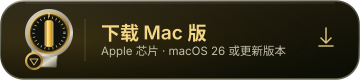

<div align="center">

[](https://kagerou.glass/sevoflurane/)


# Sevoflurane

[English](README.md) · [简体中文](README.zh-CN.md)

**处方编号 013 ・ se·vo·flu·rane /ˌsiːvoʊˈflʊəreɪn/ ・ 给游戏用的挥发性麻醉药 ♡**

[](https://kagerou.glass/sevoflurane/)
[](https://x.com/kageroumado)
[](#开始使用)

<a href="https://github.com/kageroumado/sevoflurane/releases/latest/download/Sevoflurane.dmg"></a>

<table>
  <tr>
    <td align="center"><br><sub><b>给 Steam 换个家</b> ・ Mac 窗口里的游戏库</sub></td>
    <td align="center"><br><sub><b>菜单栏</b> ・ 最近玩过的游戏，点一下就开玩</sub></td>
  </tr>
</table>

</div>

**在 Apple 芯片 Mac 上玩 Windows 版 Steam 游戏，Steam 界面也用上 Mac 窗口。**

照常在 Steam 里逛游戏库、安装游戏、和朋友聊天。Sevoflurane 通过 Wine，在后台运行 Windows 版 Steam 客户端和兼容的游戏。

## 我的游戏能玩吗？

[社区兼容性数据库](https://kagerou.glass/sevoflurane/games/?lang=zh-CN)可以查看游戏在不同 Mac 和渲染器上的运行情况。数据来自玩家开启**共享运行统计数据**后，由 Sevoflurane 自动记录的实际游玩过程。每次共享包含引擎、渲染器、硬件、分辨率、游玩时的帧率和结束方式，数据库再根据这些记录判断运行情况。

想贡献数据，在**设置 › 通用 › 社区 › 共享运行统计数据**中开启，然后照常玩就好。有人分享运行记录后，游戏就会出现在数据库里。

<p align="center"><a href="https://kagerou.glass/sevoflurane/games/?lang=zh-CN"></a></p>

## 主要功能

- **清晰的 Steam 界面。** 使用原生网页视图，按屏幕的实际缩放比例显示，保持 Retina 清晰度。Steam 菜单放进菜单栏，通知交给 macOS 显示。
- **游戏窗口也能随手调整。** 每款游戏都有真正的 Mac 窗口。即使是原本锁定窗口大小的老游戏，也能调整大小、进入原生全屏。
- **按需开启超分与缩放。** 游戏保持自己的渲染分辨率，再把画面放大到窗口大小。可以选 Lanczos、MetalFX，或适合动漫画面的 Anime4K 和 CuNNy。
- **DirectX 12。** 通过 Sevoflurane 自己的 Wine 版本 [Dormison](https://github.com/kageroumado/dormison/blob/main/README.zh-CN.md)，配合 Apple 游戏移植工具包（Game Porting Toolkit）中的 D3DMetal 运行游戏。
- **自动启用游戏模式。** 每款游戏都作为独立的 Mac App 启动，有自己的名称和程序坞图标。游戏全屏时，macOS 会自动开启游戏模式。
- **Steam 以外的程序。** 从访达打开 Windows 程序，Sevoflurane 会判断它是游戏还是安装程序，帮你运行或安装，也提供同样的窗口和游戏功能。

## 开始使用

1. **下载并打开。** 挂载[磁盘映像](https://github.com/kageroumado/sevoflurane/releases/latest/download/Sevoflurane.dmg)，把 Sevoflurane 拖进“应用程序”，然后打开。
2. **安装引擎和依赖。** 选择 Dormison 或 CrossOver 作为引擎，新建一个容器（bottle），或接入已有的容器。
3. **登录 Steam。** 和平时一样登录就好。
4. **开始玩。** 随时可以换引擎，也可以为每款游戏单独设置。

Sevoflurane 需要搭载 Apple 芯片、运行 macOS 26 或更新版本的 Mac。没有安装 Rosetta 时，设置向导会帮你安装。要玩 DirectX 12 游戏，请在设置过程中添加 Apple 的游戏移植工具包，下载时需要登录 Apple 账户。CrossOver 自带工具包中的图形转换组件 D3DMetal。

## 渲染器

在“设置 › 图形”中选择默认渲染器；菜单栏里的游戏菜单，或“设置 › 游戏”，可以为单款游戏选择渲染器。

| 渲染器 | 支持范围 | 用途 |
|---|---|---|
| **D3DMetal** | 通过 Apple 游戏移植工具包支持 Direct3D 11 和 12 | DirectX 12 游戏必需。使用 Dormison 时需要安装工具包。 |
| **DXMT** | 通过 Metal 支持 Direct3D 10 和 11 | Dormison 在安装 D3DMetal 之前使用的默认渲染器。 |
| **DXVK** | 通过 Vulkan 和 MoltenVK 支持 Direct3D 9 至 11 | 适合尝试运行 DirectX 9 游戏，或在 Metal 渲染器出问题时换用。 |
| **自动** | 使用 CrossOver 针对各款游戏的配置，回退到 Wine 渲染器 | 使用 CrossOver 引擎时读取它的兼容性数据库。 |
| **Wine 内建** | Wine 的 `wined3d` 渲染器 | 游戏在其他渲染器上遇到问题时，可以试试这个。 |

工具包的正式版和测试版可以同时安装，默认选择最新版本，也可以手动指定。DXMT 和 DXVK 的不同版本也可以分别安装。

引擎支持单款游戏配置文件时，窗口、画面缩放器和鼠标设置会在下次启动游戏时生效；其他引擎需要重启 Steam，才能继承这些设置。

更换渲染器后，请从菜单栏启动游戏来应用更改。Steam 保持打开时，Sevoflurane 也能准备好渲染器文件；更换引擎或调整 msync 则需要重启。切换 DXMT 或 DXVK 版本后，也需要重启 Steam 才会生效。

## 已知限制

- 需要 Windows 内核反作弊的游戏或联机模式无法运行，但游戏的离线模式可能仍然可用。
- Windows 部分通过 Rosetta 运行，因此需要安装 Rosetta，也会有转译开销。缺少 Rosetta 时，设置向导会安装它。
- DirectX 12 需要 Apple 游戏移植工具包。它只能由 Apple 分发，设置向导会通过你的 Apple 账户下载。32 位 DirectX 12 游戏无法运行。
- 画面缩放器在游戏启动时接入。运行中切换缩放算法会立即生效；如果要把缩放器从关闭改为开启，或从开启改为关闭，需要下次启动游戏才会生效。
- 使用多重采样、立体渲染、浮点或 10 位格式的 OpenGL 绘制表面会直接显示，不经过画面缩放器。DXMT 和 DXVK 通过画面呈现器（presenter）显示的路径尚未测试。
- 线程等待的“实验性”预设在合成测试中缩短了线程间等待，但在已测游戏（《黑神话：悟空》《古墓丽影：崛起》）中没有提高帧率。默认关闭；“自定义”预设可以调整其中的三个数值。
- Media Foundation 视频使用软件解码。
- 使用 Mono 的 Unity 游戏如果在启动几秒内崩溃（如 TABS、《赤マント》），属于尚未解决的引擎问题。
- Steam 游戏内叠加界面由 Sevoflurane 以独立窗口承载，显示在游戏旁边，不会画进游戏本身的画面。

## 遇到问题

**设置 › 关于 › 存储诊断信息…** 会保存一个 ZIP，包含日志、`sevo doctor` 报告、引擎信息、Steam 自身的日志和最近的崩溃报告。里面的每个文件都会移除账户名、个人文件夹路径、Mac 名称和 Steam ID；分享前还是建议自己看一遍。也可以在终端运行 `sevo diag`。

游戏崩溃，或卡死后被看门狗结束时，Sevoflurane 会询问是否向开发者发送这次运行的脱敏报告。选择“不再询问”即可关闭这个提示。

主要日志在 `~/Library/Logs/Sevoflurane.log` 和 `~/Library/Logs/Sevoflurane-wine.log`。Wine 日志始终记录错误和异常，所以游戏自行退出也会留下线索。“设置 › 诊断”控制每次运行的记录量；如果还不够，可以在“设置 › 引擎”开启记录游戏加载的每个库。`sevo runs` 会列出每次启动所用的环境和结束方式，“报告”窗口会显示同样的记录，以及崩溃留下的信息。

请使用 [Issue 模板](https://github.com/kageroumado/sevoflurane/issues/new/choose)反馈问题。调试和参与开发的方法见 [CONTRIBUTING.md](CONTRIBUTING.md)。

## 命令行

App 在 `Sevoflurane.app/Contents/Helpers` 中附带 `sevo`。可以在“设置 › 通用”把它安装到 `PATH`，或运行 `Sevoflurane.app/Contents/Helpers/sevo install-cli`。单独构建 `sevo` scheme 后，也可以直接运行 Xcode 构建目录里的版本。

先用 `sevo doctor` 检查安装，或用 `sevo status` 查看客户端的运行状态。每个命令都可以加 `--help` 查看参数和输出选项。

```text
sevo doctor [--json]
sevo setup [--engine E]
sevo status [--json]
sevo wait [--gone]
sevo diag save|on|off|status
sevo runs
sevo report RUN --verdict V [--note N]
sevo perf list|report|compare|label|mark
sevo stats status|preview|reports|delete
sevo client start|stop|restart|force-quit|update|clear-shader-cache|pin|unpin|logs
sevo recover [--deep]
sevo daemon repair
sevo app list|info|launch|terminate|install|verify|uninstall|compat|config|repair-dll|detect
sevo program add PATH|list|remove ID|launch ID|run PATH [ARGS]
sevo engine list|install [--file TARBALL]|d3dmetal|use|channel|check-manifest
sevo update check|use|install|remove
sevo bottle list|config <key> [value]|deps [install ID]
sevo shaders list|install|remove
sevo storage [--games]
sevo nwjs list|add
sevo downloads status [--json]|pause|resume|throttle KBPS
sevo holds
sevo orphans [--end]
sevo run PROGRAM [ARGS]
sevo debug on|off|status
sevo eval 'JS'
sevo cdp 'JS' [TARGET]
sevo benchmark
sevo logs [--tail N] [-f] [--wine]
```

`sevo recover --deep` 还会清除网页缓存并修复客户端。`sevo diag save` 保存报告时，会附带容器中 Steam 自身的引导、连接、webhelper、游戏进程和控制台日志；加上 `--no-steam-logs` 可以省略这些日志。`sevo perf compare` 会比较设置更改前后，游戏的平均帧率和 1% low 是否有可测量的变化；`sevo holds` 会列出是什么让显示器保持唤醒。

退出码：0 表示成功，1 表示操作失败，2 表示调用方式无效，3 表示安装不完整，4 表示无法连接客户端。App 运行时，客户端的启动、退出和重启等命令会经过它的监管程序。

### MCP

`sevo mcp` 提供一个 stdio MCP 服务器。它的 27 个工具涵盖诊断、客户端恢复、游戏库查询、游戏安装与启动、快速启动程序、下载、最近的运行记录、帧时间比较、诊断级别和日志。还提供 `sevo://status`、`sevo://doctor`、`sevo://log` 和 `sevo://library` 资源。

“设置 › 通用”会列出检测到的助手，每个助手有独立的注册开关：Claude Code（附带一个指导诊断流程的 skill）、Claude Desktop、Codex 和 Hermes。其他助手可以手动添加：

```json
{ "mcpServers": { "sevoflurane": { "command": "sevo", "args": ["mcp"] } } }
```

只有在服务器环境中设置 `SEVO_MCP_ALLOW_EVAL=1`，才会开放 `eval_js`。

## 工作原理

Windows 版 Steam 客户端在 Wine 容器中运行。容器就是一个存放 Windows 文件和设置的目录。Sevoflurane 把 Steam 的网页界面加载到 `WKWebView` 中，通过 8765 端口上的 Chrome DevTools Protocol，将界面的 `SteamClient` 调用连接到客户端。

Protobuf 通信使用由客户端上下文打开的独立套接字。Sevoflurane 根据用途把 Steam 窗口分为游戏库、聊天、菜单、叠加界面等，再放进 macOS 窗口。

Dormison 提供 D3DMetal、msync、Rosetta 下的 32 位游戏、Steam 启动和 Metal 画面呈现器所需的 Wine 改动。也可以使用 CrossOver 或 CrossOver Preview 作为引擎。引擎通过 Rosetta 运行，Sevoflurane 本身则原生运行在 Apple 芯片上。

### 源码结构

- `Sevoflurane/` — App 本身的代码。`Web/` 承载 Steam 界面和窗口；`Bridge/` 连接页面与客户端；`App/` 包含 App 生命周期、菜单栏、窗口和设置；`Setup/` 是首次运行向导。
- `Supervision/` — App 与后台辅助程序共用的代码：日志、本机回环服务器、游戏窗口监测。
- `Core/` — App、辅助程序和 `sevo` 共用的代码：引擎、容器、环境准备、游戏配置、运行记录和 CDP 客户端。
- `SevofluraneDaemon/` — 监管 Steam 的后台辅助程序。
- `Sevo/` — CLI 和 MCP 服务器。
- `Shared/` — App、辅助程序和快速查看扩展都会编译的代码：读取 Windows 可执行文件中的图标和版本字符串，并绘制符合 macOS 外形的图标。
- `SevofluraneThumbnail/` — 在访达中显示 Windows 程序图标的快速查看扩展。
- `SevofluraneTests/` — 测试包。
- `Tools/` — 着色器打包、调试和性能工具。

## 构建方法

1. 使用带有 macOS 26 或更新 SDK 的 Xcode 打开 `Sevoflurane.xcodeproj`。
2. 在 Signing & Capabilities 中选择你的开发团队，构建 `Sevoflurane` scheme。
3. 打开 App，跟随设置向导安装 Steam，然后登录。

引擎在单独的仓库中构建，具体步骤见 [Dormison 构建指南](https://github.com/kageroumado/dormison/blob/main/build-macos/README.md)。

## Dormison 配置开关

<details>
<summary>引擎读取的注册表项和环境变量</summary>

设置界面、`sevo bottle config` 和 `sevo app config` 会帮你配置这些选项。这里列出它们，方便直接使用引擎的人查阅。

#### 注册表项（`HKCU\Software\Wine\Mac Driver`）

| 键 | 默认值 | 作用 |
|---|---|---|
| `StatusItems` | 显示 | 设为 `N` 后，程序的托盘图标留在 explorer 自己的窗口中，不放进 Mac 菜单栏 |
| `ResizableWindows` | 关闭 | 允许调整游戏窗口大小，同时保持游戏自身的分辨率 |
| `Presenter` | 关闭 | 开启画面呈现器，使用普通重采样 |
| `Upscaler` | `off` | 选择 Lanczos、MetalFX Spatial 或着色器包（Anime4K、CuNNy 等）；任何非 `off` 的值都会开启画面呈现器 |
| `FinalFilter` | `lanczos` | 画面缩放器之后的重采样步骤 |
| `FrameRate` | 关闭 | 显示帧率胶囊 |
| `FrameRateGraph` | 关闭 | 显示帧时间卡片（同时开启 `FrameRate`） |
| `OpenGLPresenter` | 开启 | 设为 `N` 后，所有 OpenGL 绘制表面都绕过画面呈现器 |
| `LinearMouse` | 关闭 | 视角转动使用原始鼠标移动输入 |
| `CursorConfine` | 关闭 | 通过窗口服务器把光标限制在游戏指定的区域内 |
| `PresentationLog`, `PresenterLog`, `PresenterDebug` | 关闭 | 画面呈现流程和呈现器日志 |

#### 环境变量

| 变量 | 作用 |
|---|---|
| `SEVO_RESIZABLE_WINDOWS`, `SEVO_PRESENTER`, `SEVO_UPSCALER`, `SEVO_FINAL_FILTER`, `SEVO_FPS`, `SEVO_FPS_GRAPH`, `SEVO_GL_PRESENTER`, `SEVO_LINEAR_MOUSE`, `SEVO_CURSOR_CONFINE` | 上述注册表项在整个容器中的默认值 |
| `SEVO_PRESENTATION_LOG`, `SEVO_PRESENTER_LOG`, `SEVO_PRESENTER_DEBUG`, `SEVO_GFX_LOG` | 画面呈现流程、呈现器和 D3DMetal present 钩子的日志 |
| `SEVO_SHADER_DIR` | 画面呈现器加载着色器包的目录 |
| `SEVO_GPU_VENDOR_ID`, `_DEVICE_ID`, `_NAME`, `_MEMORY_MB`, `_DRIVER_VERSION`, `_DRIVER_PROVIDER`, `_DRIVER_DATE` | Windows 程序看到的 GPU 型号、显存和驱动信息（厂商未知时使用 NVIDIA 元数据） |
| `SEVO_FORCE_UMA` | 设为 `1` 时，报告 GPU 实际是否使用统一内存，以及 Mac 的真实内存容量 |
| `SEVO_LARGE_ADDRESS_AWARE` | 设为 `1` 时，让 32 位程序使用完整的 4 GB 地址空间 |
| `SEVO_OBJECT_SPIN`, `SEVO_ACK_SPIN`, `SEVO_WAIT_SPIN`, `SEVO_WAIT_SPIN_ADAPT`, `SEVO_YIELD`, `SEVO_ALERT_ALWAYS_WAKE` | 线程等待前的可选自旋（默认关闭） |
| `SEVO_SYNC_STATS` | 写入各进程等待计数的文件路径 |
| `SEVO_COREAUDIO_DEVICE_BUFFER` | 设为 `1` 时，把缓冲区大小和音量写到整个音频设备上，用于对比 |
| `SEVO_ENV_FILES` | 设为 `0` 时，同时关闭 `.sevo` 环境文件和 App 包加载器 |
| `SEVO_OWNER_PID`, `SEVO_SUPPRESS_WINDOWS`, `SEVO_LOADER`, `SEVO_LOADER_TREE` | 程序坞适配层：退出时结束容器的所属进程、隐藏 Steam 自身窗口，以及加载器 |
| `SEVO_QUIET` | 设为 `1` 时，让进程不出现在程序坞和屏幕上 |
| `SEVO_RUNNER`, `SEVO_NWJS`, `SEVO_NWJS_DIR` | 程序坞适配层的原生 NW.js 运行器 |
| `SEVO_STEAM_STUB`, `SEVO_STEAM_APPID`, `SEVO_STEAM_STUB_DIR`, `SEVO_STEAM_STUB_PORT`, `SEVO_STEAM_STUB_IDLE`, `SEVO_STEAM_API_DIR` | 为原生 NW.js 游戏提供成就功能的 Steamworks 桩 |
| `SEVO_CLI` | View（显示）菜单调用的 `sevo` |

</details>

## 许可证

MIT。项目与 Valve 无关联。Steam 是 Valve Corporation 的商标。

## 完整功能列表

<details>
<summary>按类别查看 Sevoflurane 的全部功能</summary>

标有 **（Dormison）** 的功能需要 Dormison 引擎，其余功能也可以在 CrossOver 上使用。

### 设置向导

- 首次运行向导会安装 Steam，并引导你登录。
- 选择 Dormison（随 App 附带或下载），或已安装的 CrossOver、CrossOver Preview，同时显示各个版本的试用或授权状态。
- 接入 Mac 上已有的 Steam，或新建一个有名字的容器。“下载全部”还会安装可选字体和旧版运行库（约 320 MB）。
- 安装分为六个有名称的阶段，实时显示百分比。缺少 Rosetta 时会安装它。
- Apple 游戏移植工具包可以在 App 内登录 Apple 账户下载，也可以通过浏览器下载（会监测“下载”文件夹），或选择已有文件。CrossOver 自带 D3DMetal。
- 关闭窗口后，设置向导会继续在菜单栏中运行；重新打开就能回到原来的进度。
- `sevo setup` 可以不打开窗口完成设置。

### Mac 窗口里的 Steam

- 游戏库、商店、好友和聊天都放在原生窗口中，使用真正的红黄绿窗口按钮。
- Steam 菜单（Steam、显示、好友、游戏、帮助）放在 macOS 菜单栏中。
- 聊天、搜索和笔记中可以复制粘贴。
- 商店、社区和个人资料页面打开时保持登录。
- 好友和聊天各有独立窗口。有未读消息时，打开“好友”会进入等待最久的对话。
- Steam 通知通过 macOS 通知显示，并沿用 Steam 中选择的提示音。只有 Steam 确实需要显示通知时，才会请求权限。
- Shift+Tab 叠加界面以面板形式显示在游戏上方，不抢走游戏焦点。
- 大屏幕模式、屏幕键盘和控制器配置器各有独立窗口。
- Steam 询问“要如何启动这个游戏”时，会显示 macOS 提示框，选项名称沿用 Steam 原文。
- 网页上的 `steam://` 链接可以用 Sevoflurane 打开（在“设置 › 通用”中设为由它接管）。
- 开启低电量模式或减弱动态效果时，Steam 中对应的设置也会开启；关闭后恢复你原来的设置。
- 游戏页面会显示 Mac 兼容性和反作弊信息，来源为 AppleGamingWiki、AreWeAntiCheatYet 和 ProtonDB，并附上各自的链接。ProtonDB 报告描述的是 Linux 运行情况；没有 Mac 报告时，详情中会说明。

### 菜单栏

- 最近玩过的游戏带有封面、开始按钮和实时启动状态。
- 向下滚动可以查看所有已安装游戏，按字母索引。
- 每款游戏的菜单提供：本次使用指定渲染器运行、始终使用指定渲染器运行、游戏设置，以及“在程序坞中保留”。
- 快速启动程序和游戏放在一起，可以在访达中显示或移除。“添加 Windows 游戏…”会打开文件选择器。
- 健康状态卡片说明客户端出了什么问题，并提供修复操作。
- macOS 尚未批准后台辅助程序时，会显示提示卡片。
- 系统负载异常升高时，显示造成高负载的程序名称；负载恢复后提示消失。
- Steam 长时间把游戏停在“正在同步”时，会给出提示。
- 缺少必要的 Windows 组件时，提示容器不完整。
- 打开 Steam（⌘O）、好友（⌘F，附未读数量）和状态标签。
- ⋯ 菜单提供：重新加载 Steam 界面、重启 Steam 客户端、重启 Windows、强制退出 Steam、强制退出全部、打开事件日志、调试模式、自动更新。
- 底部可以切换渲染器，退出时会请求确认。

### 玩游戏

- **（Dormison）** macOS 把每款游戏视为独立 App：有自己的程序坞项目、名称和图标，在前台全屏运行时启用游戏模式。
- **（Dormison）** 选择“在程序坞中保留”，或把游戏从菜单栏拖到程序坞，就能保留它的图标，之后点一下即可启动。
- **（Dormison）** 全屏游戏和锁定窗口大小的游戏，也能以自身分辨率运行在可调整大小的窗口中。
- **（Dormison）** 通过 Metal、OpenGL（Wine 内建渲染器，大多数 Direct3D 9 视觉小说使用这条路径）和普通 GDI 绘制的游戏，可以使用 Lanczos、MetalFX、Anime4K 或 CuNNy 进行超分与缩放，再应用最终滤镜。
- **（Dormison）** 每款游戏都有 View（显示）菜单，可以实时切换画面缩放器和滤镜，以及选择 Show Frame Rate（显示帧率，⌥⌘F）、Show Frame Time Graph（显示帧时间图，⌥⌘G）、Show Picture Details（显示画面详情，⌥⌘I）。
- D3DMetal 通过 MetalFX 提供 DLSS：游戏里的 DLSS 选项可以像在 NVIDIA 显卡上一样使用。
- **（Dormison）** 为有需要的游戏提供原始鼠标视角输入和光标范围限制。
- 游戏运行时让显示器保持唤醒，退出后允许显示器休眠。
- 游戏点击关闭按钮后没有响应时，可以选择继续等待或结束游戏。
- NW.js 游戏（包括 RPG Maker MV 和 MZ）使用 macOS 运行时运行，保留 Steam 游戏时长和成就。
- Discord 使用游戏自己的条目显示“正在玩 <游戏>”。自带 Discord 支持的游戏通过容器内的中继发布自己的状态 **（Dormison）**。两项功能在“设置 › 通用”中分别开关。

### Steam 以外的 Windows 程序

- 在访达中用 Sevoflurane 打开任意 `.exe`，或选择“添加 Windows 游戏…”。面板会显示图标、名称和版本，并判断它更像游戏还是安装程序；可以只运行一次，也可以加入快速启动。
- 安装程序运行完后，Sevoflurane 会列出它新增的程序，让你选择要保留哪些。移除程序时，会把其安装程序写入的文件移到废纸篓。
- 快速启动程序和 Steam 游戏一样，支持单独设置、程序坞图标、运行记录和报告。
- **访达缩略图**：在访达的图标、列表、画廊视图和快速查看中，`.exe` 会显示自己的图标。图标直接从文件读取，无需运行程序。Sevoflurane 运行过一次后即可使用。
- 程序需要 Windows 内核驱动时，Sevoflurane 会提示。

### 设置

设置可以精确搜索到每一行，选中后对应行会闪烁提示。每一行都有一句简短说明，点 (i) 可以查看完整解释。

- **通用**：登录时打开、自动重启 Steam、Steam 自身设置、`steam://` 链接、命令行工具、AI 助手、兼容性信息栏、社区分享、Discord、卸载。
- **图形**：默认渲染器、向游戏报告的 GPU 信息、DXMT 和 DXVK 版本、着色器包。
- **引擎**：引擎、容器和发布渠道、msync、所有游戏的默认设置、游戏依赖、DLL 覆盖、Wine 配置、库加载日志、修复。
- **游戏**：单款游戏的画面、鼠标、性能和 DLL 覆盖设置，未单独修改的项目会继承引擎默认值。游戏需要某个设置时，会标出**已知修复方案**，点一下即可应用。
- **存储空间**、**恢复**、**诊断**：见下文。
- **关于**：版本、链接、各个第三方组件和数据源的致谢，以及许可证。

游戏依赖包括 Visual C++ 运行库、Direct3D 着色器编译器、DirectX June 2010、核心字体和中日韩字体。每项都可以单独安装，新建容器会全部安装。DLL 覆盖使用 Wine 自身的加载顺序，可以对整个容器或单款游戏设置；`sevo app repair-dll` 会安装缺失 DLL 所属的软件包，并为该游戏固定相应的修复配置。

### 存储空间

- 用一条容量条显示整个磁盘，把 Sevoflurane 占用最多的类别和其他内容放在一起。
- 显示各类别、游戏和程序的大小，与 Steam 报告的数值一致。
- 缓存、引擎、渲染器版本和着色器包等可以重新生成或下载的内容，提供移到废纸篓的按钮。游戏通过 Steam 卸载。
- 管理游戏库，对 Wine 无法可靠使用的磁盘给出提醒。
- **容器之间共享游戏**：可以链接其他容器里已安装的游戏，包括 CrossOver 等任何引擎的容器，无需再次下载。磁盘上保留一份游戏文件，存档各自独立；在下次重启 Steam 前可以撤销。

### 保持 Steam 正常运行

- 后台辅助程序管理 Windows 部分。客户端卡死或崩溃时，会尝试重启、清除网页缓存并修复；如果仍然反复崩溃，就停止重试并报告问题。
- 正常退出 Sevoflurane 会同时退出 Steam 和容器内的所有程序。如果 Sevoflurane 在游戏中途崩溃或被强制退出，游戏会继续运行，重新打开 App 即可重新接管。
- 首次运行时，macOS 会要求批准辅助程序（系统设置 › 通用 › 登录项与扩展）。未批准时 Steam 无法启动，App 会说明原因。
- 系统负载较高时（其他 App 占用处理器、内存压力、温度、低电量模式），辅助程序会把判定 Steam 卡死前的等待时间延长到平时的两到三倍，并在日志中记录原因。
- Wine 服务器退出后，残留进程会自动结束（`sevo orphans` 可以列出它们）。
- **设置 › 恢复**：重启或强制退出 Steam、取消卡住的菜单、修复辅助程序或容器、重新安装着色器编译器、重启 Windows、清除着色器缓存、重建 Steam 环境（保留游戏和存档）。
- **常见问题**：内置指南根据你看到的现象提供修复方法，包括缺少 DLL、黑屏、文字变方框、模组不生效、开场视频黑屏、菜单卡死、辅助程序无法启动。

### 社区游戏数据库

- “设置 › 通用 › 社区 › **共享运行统计数据**”（只询问一次）会把每次结束的运行记录发送到 [kagerou.glass/sevoflurane/games](https://kagerou.glass/sevoflurane/games)：游戏、引擎、渲染器、设置、macOS 版本、芯片、运行时长、游戏帧率和结束方式。
- 数据不包含能指明你或你的 Mac 身份的信息：没有标题、路径或账户，启动时间也会取整到小时。可以预览实际发送的完整内容。
- 运行记录使用安全隔区中生成的密钥签名，Mac 支持时还会通过 App Attest 验证。**删除我共享的内容…**（或 `sevo stats delete`）会删除这些记录，并生成新的匿名身份。
- 在“报告”窗口回答“运行得怎么样？”，或使用 `sevo report`，可以添加结论（可玩、修复后可玩、可以启动、无法运行）和可选备注。
- 游戏页面按引擎和芯片展示运行情况，并附上每份报告的配置。Steam 没有销售的游戏在接入后也会有自己的页面。

### 诊断

- 三种记录级别。“始终记录”：运行记录、帧时间轨迹、事件日志、Wine 错误，以及崩溃后的报告。“诊断”额外记录异常、渲染器日志，并在每次运行后生成报告。“全部”针对单款游戏再加上库加载、图形日志、小型转储和宿主进程采样。
- 调试模式：在一次会话内收集报告所需的全部信息。
- “报告”窗口：显示每次运行所用的环境、结束方式、错误，以及对已知故障的直白解释。可以保存 ZIP，或打开预先填好的 GitHub Issue。
- 崩溃或被看门狗结束后，会询问是否发送脱敏报告。
- 进程监视器：显示 Sevoflurane 管理的所有进程，并标出占满单个核心的游戏。
- 每种日志和报告都有容量上限，优先清理最旧的内容。
- `sevo perf compare` 比较平均帧率和 1% low 是否有可测量的变化；`sevo holds` 列出是什么让显示器保持唤醒。

### 更新

- Mac 空闲且没有游戏运行时，App 会从 GitHub Releases 自动更新；也可以点击底部的更新标签立即更新。“自动更新”开关可以关闭这项功能。
- 设置按钮上出现圆点，表示有更新的引擎或渲染器。
- Dormison 提供稳定版和测试版渠道，发布包带有签名，安装前会验证。

### 引擎

- **Dormison**（[github.com/kageroumado/dormison](https://github.com/kageroumado/dormison/blob/main/README.zh-CN.md)）：Wine 11.16 加 wine-staging，并加入 D3DMetal 支持、msync、Rosetta 下的 32 位游戏、Steam 启动修复、画面呈现器、程序坞集成、Discord 中继、通过 GStreamer 播放的 Media Foundation 视频、日文字体，以及 arm64 wineserver。
- **CrossOver** 和 **CrossOver Preview**：使用各自附带的 D3DMetal 和按游戏选择的配置。
- 如果某个已知版本的 D3DMetal 会导致游戏崩溃，会在本机副本上应用针对该构建、精确匹配字节的修复。原版保存在旁边；重新安装工具包即可恢复 Apple 的版本。
- 在设置中或通过 `sevo engine use` 切换引擎，下次重启客户端时生效。

</details>
